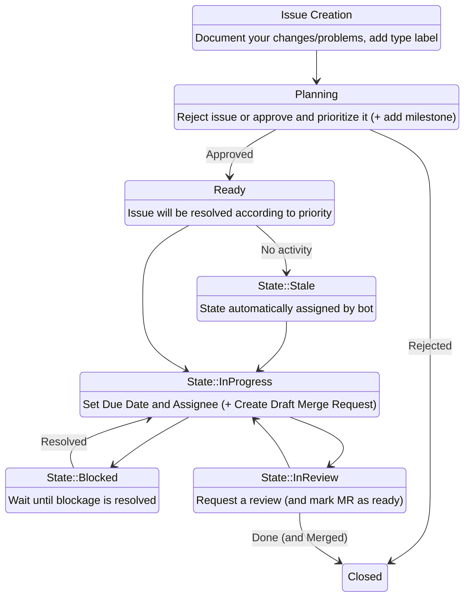

# Contributing
## Contribution rules
1. Changes must be documented in a change request issue first, where they can be discussed with the maintainers (Maintainers *MAY* ignore this rule)
1. **CI/CD** Pipelines must pass for a Merge-Request to be accepted
1. A Merge-request from non-maintainer contributions must be approved by one of the Project maintainers
1. Code formatting must remain uniform throughout the project, check [.clang-format](.clang-format) and [.clang-tidy](.clang-tidy) for formatting rules
1. `CMakeLists.txt` format remains uniform throughout the project
1. You successfully built at least 1 conan package with every defined conan option of your latest changes locally
1. Your changes are tested in the [testRunner.cpp](unit_tests/testRunner.cpp) if applicable
1. New external dependencies are documented in [NOTICE](NOTICE) file
1. New external dependencies are compatible with project [LICENSE](LICENSE) file
1. Development work is done in accordance to [**Implementation guidelines**](#implementation-guidelines)
1. All of the contributions are committed in good faith, without malicious intent to cause damage
1. All contributions of any kind are done in an utmost professional manner

## General Contribution Procedure

Any kind of non-maintainer contribution must be done as follows:



Maintainers are not required to follow the procedure above, but are encouraged to open an issue documenting the task and creating a separate merge request linked to that issue.

## Implementation guidelines

When working on the code, developers are expected to follow these guidelines:

1. **Do not** import namespaces with `using namespace_name` in header files, use namespace imports in source files only. Importing namespaces in header files leads to namespace pollution and is considered a bad practice;
1. **Do not** nest *exception* definitions inside classes, make them standalone under the project namespace. Exceptions should be easy to use for the users, since they are expected to handle them. Nesting exceptions, obfuscates them, thus making them harder to use. If you need custom exceptions for implementation reasons only, move them to source file or `details` namespace, if it is not practical to move them to source files;
1. **Do not** capture `std::shared_ptr` instances in lambdas, use `std::weak_ptr` or raw pointers instead, see [lambda + shared_ptr = memory leak](https://floating.io/2017/07/lambda-shared_ptr-memory-leak/) for more detail;
1. **Do not** add dependencies without the project maintainer validating them first. Dependencies need to be vetted by the maintainer to ensure security, reliability, license compliance and future maintainability;
1. **Do not** create symbolic links or shortcuts between files in the repository. Symbolic links are handled differently on different operating systems, they also obfuscate project layout;
1. **Do not** create source/header files with multiple thousands of lines. Split large files into multiple ones when possible (this also applies to `.cc` files). Large files are harder to maintain, they also slow down code linting and processing tools thus slowing down the CI/CD pipeline;
1. **Do not** define [CMake Options](https://cmake.org/cmake/help/latest/command/option.html) outside root `CMakeLists.txt`. Root `CMakeLists.txt` is the standard file where project wide configuration occurs, so users expect to find all project configuration settings there. Moving option definitions to other files, breaks this expectation;
1. **Do not** optimize the code prematurely, only do so then there is a known and measurable problem. Using standard best practices (capture by `const&`, moving values, etc.) is fine. Optimization is a balancing acting, something must be sacrificed for something else to be gained. Without understanding the problem, there is no way of knowing what should be sacrificed and what should be prioritized;
1. Limit the use of preprocessor macros (preferably, only use macros to enable/disable parts of code). C preprocessor macros generally cause portability problems, especially for Windows systems. Furthermore, preprocessor macros can be modified by anyone after being defined, thus potentially causing unwanted behavior;
1. If you need to use  preprocessor macros, define them with long and unique names, if needed append a random (at least 4 digit long) hexadecimal number to increase their uniqueness. Since preprocessor macros can be redefined, it is a good practice to reduce accidental redefinitions by creating unique and long macro names;
1. Design the `sources/Example/main.cpp` as an introduction for other developers on how to use this project, i.e., provide a usage example. This example **SHOULD** be easy to understand and does not need to be optimized (examples are not packaged, so there is no need to worry about optimizations, focus on understandability instead). These examples **SHOULD NOT** cause segmentation faults, or throw exceptions outside of `main()` function, since `sources/Example/main.cpp` target is executed in CI/CD pipeline, and doing so would cause the CI/CD job to fail;
1. Put input files (for example `conf.ini`, `config.json`, `logo.png`, etc.) that are required by the `sources/Example/main.cpp` under `config` directory and the ones that are required by the `unit_tests/testRunner.cpp` under `unit_tests/config` directory. This lets users know which input files are meant for standard operation and which ones are meant for testing. It also simplifies code packaging;
1. Add manually written documentation as markdown files under `docs/manual` to explain feature usage in more detail. The generated documentation, will be used by external users, that may not have access to source files;
1. Document interfaces, their public methods, public functions and exceptions with [Doxygen comments](https://www.doxygen.nl/manual/docblocks.html);
1. Hide templated function definitions under nested *details* namespace and their headers under **details** directory, when practical. **DO NOT** do this if such separation just complicates maintainability and does not reduce code complexity.  Separating out the templated code (either by splitting definition and declaration or just moving the entire templated block) can reduce code complexity as well as help users focus on the essentials, by not overloading them with unnecessary information;
1. Test exported symbol accessibility in `test_package/example.cpp`. No need to design complex test scenarios, just test if the users can access exported symbols;
1. 100% test coverage is **nice to have**, not a must;
1. It's okay to duplicate code in unit tests. Unit tests **SHOULD** be easy to understand and modify. Adding complex abstractions (for example, adding custom classes that create tests outside of unit test cases, custom syntax to generate test parameters, etc.) reduces maintainability and often times does not play well with the testing framework. If you can't do it with the standard [GTest](https://google.github.io/googletest/) tools (fixtures, mocks, parameter suites, assertions, etc.), it's probably not a good idea;
1. Separate unit tests suites into separate `.cc` files to reduce code complexity and speed up linting tools;
1. Add private headers (header files that won't be exported to the user) under `includes/private` directory and public headers (header files, that will be exported to the user) under `includes/public` directory. If you have multiple targets, use directories with their names (`includes/Target1/*.hpp`, `includes/Target2/*.hpp`, etc.) and configure cmake target properties to separate public/private headers. If you only use public headers and have a single library target, put them under `includes` directory;
1. Design public headers as interfaces and try to use decoupling techniques like [PImpl](https://en.cppreference.com/w/cpp/language/pimpl.html) to limit the amount of exported symbols to only what is necessary for the user;
1. Link decoupled libraries with [PRIVATE](https://cmake.org/cmake/help/latest/command/target_link_libraries.html#libraries-for-a-target-and-or-its-dependents) scope access, if possible;
1. Mark fully decoupled external dependencies as [invisible](https://docs.conan.io/2/reference/conanfile/methods/requirements.html#visible) in conan `build_requirements` section, if possible.

## Creating a release

Releases MUST only be done by the project maintainers. Non-maintainers MAY request a new release version by creating an issue named  **Create Release_v\*.\*.\*** or **Create new Release for commit \*** if one does not exist or up-voting the one that exists to avoid duplicate issues.

This issue MUST either specify the desired commit-id, that will be tagged as release, or specify the desired issues, that this release must close.

Releases should be planned with the use of Gitlab-Milestones functionality to track all of the related issues.

### Release versioning schema

Release names are based on the following schema:

```
Release_v${MAJOR_VERSION}.${MINOR_VERSION}.${PATCH_VERSION}
```

Where `${MAJOR_VERSION}`, `${MINOR_VERSION}` and `${PATCH_VERSION}` variables are versions numbers (non numeric characters are **NOT** allowed). Release versions are decided based the types of changes introduced in the release.

There are three types of changes that can be introduced in a release:
 - **Non-breaking changes** - these changes are only focused on internal implementations and **DO NOT REQUIRE** users to change anything on the their side
 - **Feature additions/deprecations** - these changes add new functionality and/or mark existing functionality as deprecated. These changes **DO NOT REQUIRE** users to change anything on the their side regarding previously released functionality
 - **Breaking changes** - these changes remove functionality or change existing interfaces in such a way, that users **MUST** adapt to the new changes in some way

Projects increment patch version for **Non-breaking changes**, minor version for **Feature additions/deprecations** and major version for **Breaking changes**.

Only the largest increment is applied for the new release with smaller increments being reset to zero. For example, if a project introduces both **Non-breaking changes** and **Feature additions/deprecations** in the release after `Release_v1.0.1` the new release version would be `Release_v1.1.0` and **NOT** `Release_v1.1.2`.
