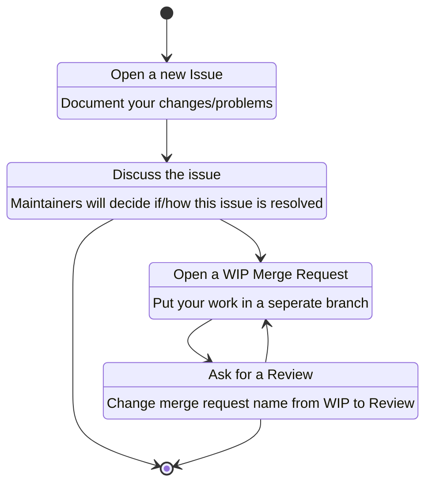

# Contributing
## Contribution rules
1. Changes must be documented in an issue first, where they can be discussed
1. CI/CD Piplines must pass for a Merge-Request to accepted
1. A Merge-request must be aporved by one of the Project maintainers, preferabbly, not the one who initiated the Merge-request. 
1. Code formating must remains uniform throughtout the project, check [.clang-format](.clang-format) and [.clang-tidy](.clang-tidy) for formating rules or use an IDE
1. `CMakeLists.txt` format remains uniform throughtout the project
1. You successfully build atleast 1 conan package localy `conan create conan/ 0.0.0@[YOUR_NAME]/development`
1. Your changes are tested in [example.cpp](conan/test_package/example.cpp) if applicable
1. Your changes are tested by [testRunner.cpp](unit_tests/testRunner.cpp) in a unit test if applicable
1. Your changes contain autodoc comments for [Doxygen](https://www.doxygen.nl/index.html) if applicable
1. New external depenencies are documented in [NOTICE](NOTICE) file
1. Your name is listed in [AUTHORS](AUTHORS)

## How to contribute

