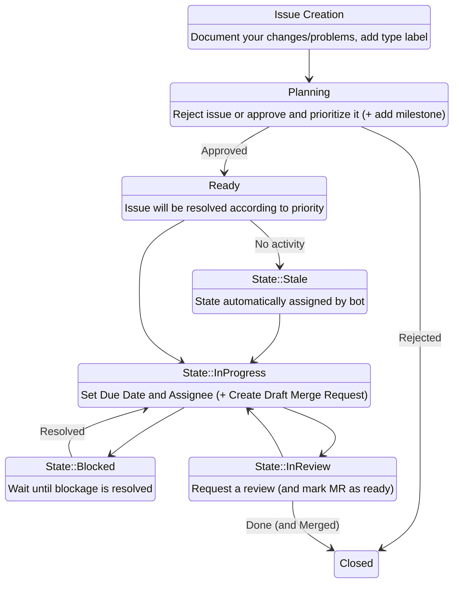

# Contributing
## Contribution rules
1. Changes must be documented in an issue first, where they can be discussed (Maintainers MAY ignore this rule for minor changes to any of the templates)
1. CI/CD Pipelines must pass for a Merge-Request to accepted
1. A Merge-request from non-maintainer contributions must be approved by one of the Project maintainers
1. Code formatting must remain uniform throughout the project, check [.clang-format](.clang-format) and [.clang-tidy](.clang-tidy) for formatting rules or use an inbuilt formatter from your chosen IDE or use provided [run-clang-format.py](utility/run-clang-format) and [run-clang-tidy.py](utility/run-clang-tidy) utilities
1. `CMakeLists.txt` format remains uniform throughout the project
1. You successfully build at least 1 conan package locally `conan create conan/ 0.0.0@[YOUR_NAME]/development`
1. Your changes are tested in [example.cpp](conan/test_package/example.cpp) if applicable
1. Your changes are tested by [testRunner.cpp](unit_tests/testRunner.cpp) in a unit test if applicable
1. Your changes contain autodoc comments for [Doxygen](https://www.doxygen.nl/index.html) if applicable
1. New external dependencies are documented in [NOTICE](NOTICE) file
1. New external dependencies are compatible with project [LICENSE](LICENSE) file
1. Your name is listed in [AUTHORS](AUTHORS)
1. All of the contributions are committed in good faith, without malicious intent to damage any of the Hahn-Schickard infrastructures
1. All contributions of any kind are done in an utmost professional manner

## General Contribution Procedure

A more extensive description can be found in the [SSoWiki](https://ssowiki.hsg.privat/en/Softwareentwicklung/Git/Startseite) (EN/DE)

Any kind of non-maintainer contribution must be done as follows:

Maintainers are not required to follow the procedure above, but are encouraged to open an issue documenting the task and creating a separate merge request linked to that issue.

## Creating a release

Releases MUST only be done by the project maintainers. Non-maintainers MAY request a new release version by creating an issue named  **Create Release_v\*.\*.\*** or **Create new Release for commit \*** if one does not exist or up-voting the one that exists to avoid duplicate issues.

This issue MUST either specify the desired commit-id, that will be tagged as release, or specify the desired issues, that this release must close.

Releases should be planned with the use of Gitlab-Milestones functionality to track all of the related issues.

### Release versioning schema

Release versions are decided on the current state of the project and the types of changes introduced in the release.

Projects can be in one of the following states: internal or public. Projects that are internal are **ALWAYS** marked as `Release_v0.*.*` and are only accessible for Hahn-Schickard employees. These projects are in active development and are not yet ready to be released to the public. Public projects **MUST NEVER BE** marked as `Release_v0.*.*`, this allows package maintainers/administrators to see at a quick glance which projects have public releases and which ones are not. A project that is marked as public **MUST NEVER BE** marked as internal, this avoids mixups between the project states. If a public project needs to be marked as internal, release names **MUST** be changed to `Refactor_v*.*.*` until it can be made public again.

There are three types of changes that can be introduced in a release:
 - **Non-breaking changes** - these changes are only focused on internal implementations and **DO NOT REQUIRE** users to change anything on the their side
 - **Feature additions/deprecations** - these changes add new functionality and/or mark existing functionality as deprecated. These changes **DO NOT REQUIRE** users to change anything on the their side regarding previously released functionality
 - **Breaking changes** - these changes remove functionality or change existing interfaces in such a way, that users **MUST** adapt to the new changes in some way

Internal projects increment patch version for **Non-breaking changes** and **Feature additions/deprecations** for new releases and increment minor version for releases with **Breaking changes**.

Public projects increment patch version for **Non-breaking changes**, minor version for **Feature additions/deprecations** and major version for **Breaking changes**.

Only the largest increment is applied for the new release with smaller increments being reset to zero. For example, if a public project introduces both **Non-breaking changes** and **Feature additions/deprecations** in the release after `Release_v1.0.1` the new release version would be `Release_v1.1.0` and **NOT** `Release_v1.1.2`.
