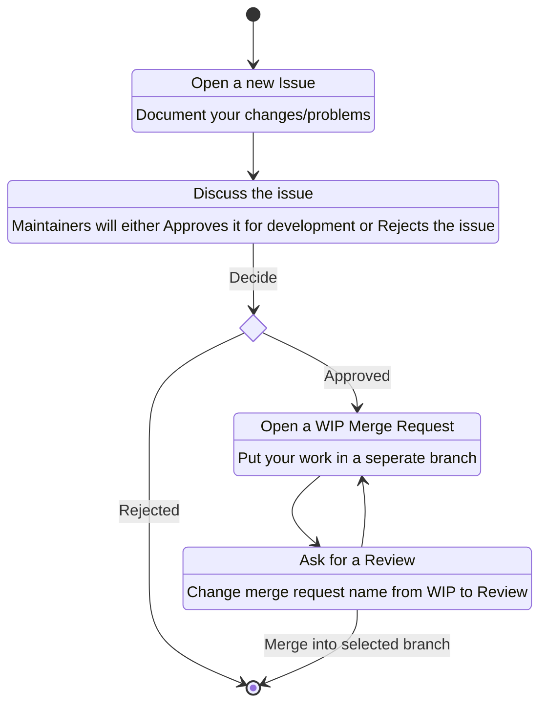

# Contributing
## Contribution rules
1. Changes must be documented in an issue first, where they can be discussed (Maintainers MAY ignore this rule for minor changes to any of the templates)
1. CI/CD Piplines must pass for a Merge-Request to accepted
1. A Merge-request from non-maintainer contributions must be approved by one of the Project maintainers
1. Code formating must remain uniform throughtout the project, check [.clang-format](.clang-format) and [.clang-tidy](.clang-tidy) for formating rules or use an inbuilt formatter from your chosen IDE or use provided [run-clang-format.py](utility/run-clang-format) and [run-clang-tidy.py](utility/run-clang-tidy) utilites
1. `CMakeLists.txt` format remains uniform throughtout the project
1. You successfully build atleast 1 conan package localy `conan create conan/ 0.0.0@[YOUR_NAME]/development`
1. Your changes are tested in [example.cpp](conan/test_package/example.cpp) if applicable
1. Your changes are tested by [testRunner.cpp](unit_tests/testRunner.cpp) in a unit test if applicable
1. Your changes contain autodoc comments for [Doxygen](https://www.doxygen.nl/index.html) if applicable
1. New external depenencies are documented in [NOTICE](NOTICE) file
1. New external depenencies are compatible with project [LICENSE](LICENSE) file
1. Your name is listed in [AUTHORS](AUTHORS)
1. All of the contributions are committed in good faith, without malicious intent to damage any of the Hahn-Schickard infrastructures
1. All contributions of any kind are done in an utmost professional manner

## General Contribution Procedure

Any kind of non-maintainer contribution must be done as follows:

Maintainers are not required to follow the procedure above, but are encouraged to open an issue documenting the task and creating a seperate merge request linked to that issue.

## Creating a release

Releases MUST only be done by the project maintainers. Non-maintainers MAY request a new release version by creating an issue named  **Create Release_v\*.\*.\*** if one does not exist or upvoting the one that exists to avoid duplicate issues.

This issue MUST either specify the desired commit-id, that will be tagged as release, or specify the desired issues, that this release must close.

Releases should be planned with the use of Gitlab-Milestones functionality to track all of the related issues.
